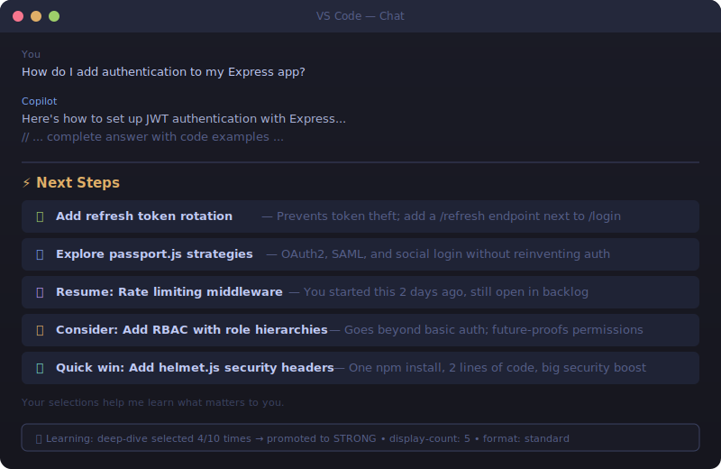

# ⚡ NextSteps

**Your AI assistant just got a memory.**

NextSteps is an agent skill that appends smart, context-aware suggestions after every response. It learns what you care about, remembers what you left unfinished, and always has a fresh idea ready.

```
## ⚡ Next Steps

1. 🔧 **Add rate limiting to the /auth endpoint** — You mentioned this during the security review
2. 🔍 **Explore connection pooling for PostgreSQL** — Could fix the latency spikes you're debugging
3. 📋 **Resume: Write integration tests for payments** — Started 3 days ago, still open
4. 💡 **Consider: Add OpenTelemetry tracing** — Would give you visibility into that slow endpoint
5. ✅ **Quick win: Pin your npm dependency versions** — 2 minutes, prevents surprise breaks
```

<p align="center">
  
</p>

---

## Install

```bash
tessl install crab/nextsteps
```

That's it. Next time your agent responds, suggestions appear automatically.

## What It Does

| Feature | How It Works |
|---------|-------------|
| **Auto-activates** | Appends suggestions after every response — no slash command needed |
| **6 categories** | Follow-ups, tasks, deep dives, memory recalls, lateral ideas, quick wins |
| **Learns your taste** | Tracks which suggestions you pick and adapts over time |
| **Remembers your backlog** | Surfaces unfinished tasks when they become relevant again |
| **Adapts to channels** | Rich format in VS Code, compact in terminals, tiny in WhatsApp |
| **Respects your preferences** | Customize count, categories, format — or turn it off entirely |

## Customize

Just say it naturally:

- *"Show me 3 next steps"* — changes the count
- *"Don't show lateral suggestions"* — excludes a category
- *"Compact format"* — switches to one-liner style
- *"Disable next steps"* — turns it off (say *"enable"* to bring it back)
- *"Reset next steps settings"* — back to defaults

## How It Learns

NextSteps watches what you do after seeing suggestions:

- **Pick one?** That category gets promoted.
- **Ignore them all?** It adjusts.
- **Same pattern 10+ times?** It locks in the preference.

No config files to edit. No settings UI. It just gets better.

## Quality

| Metric | Score |
|--------|-------|
| tessl skill review | **93%** |
| ClawHub quality | **94%** |
| Security | **Passed** — CodeGuard integrated |
| SKILL.md | 151 lines |
| Reference docs | 6 files |
| Test cases | 30 |

## Built With

- [tessl.io](https://tessl.io) — skill package manager
- [cisco/software-security](https://tessl.io/registry/cisco/software-security) — CodeGuard security rules
- Designed for [OpenClaw](https://openclaw.org) and any AgentSkills-compatible platform

## License

MIT
